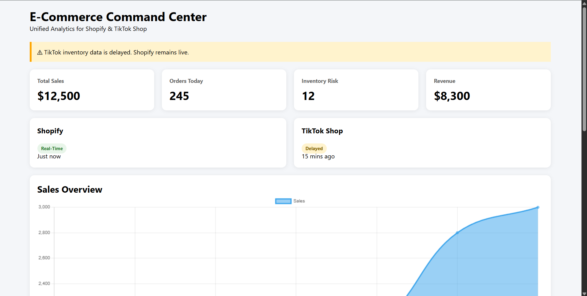
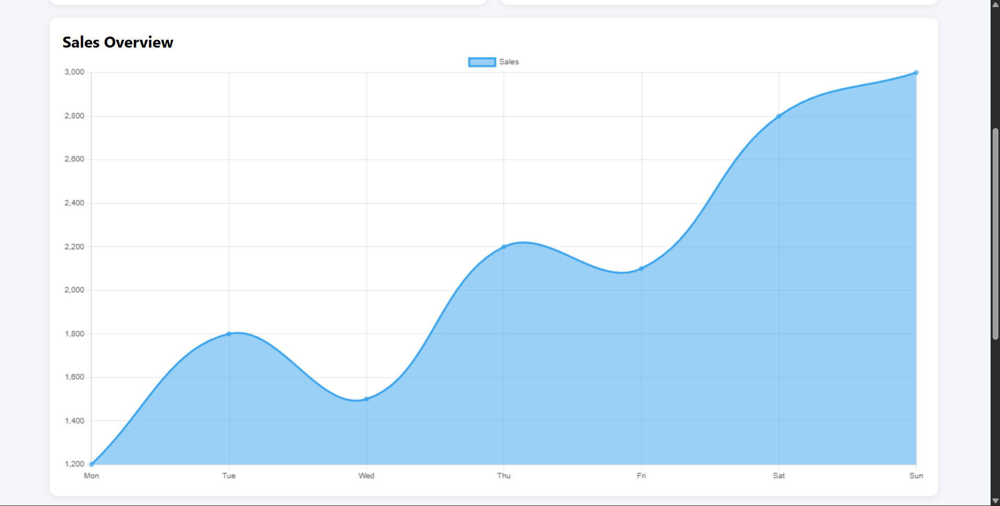
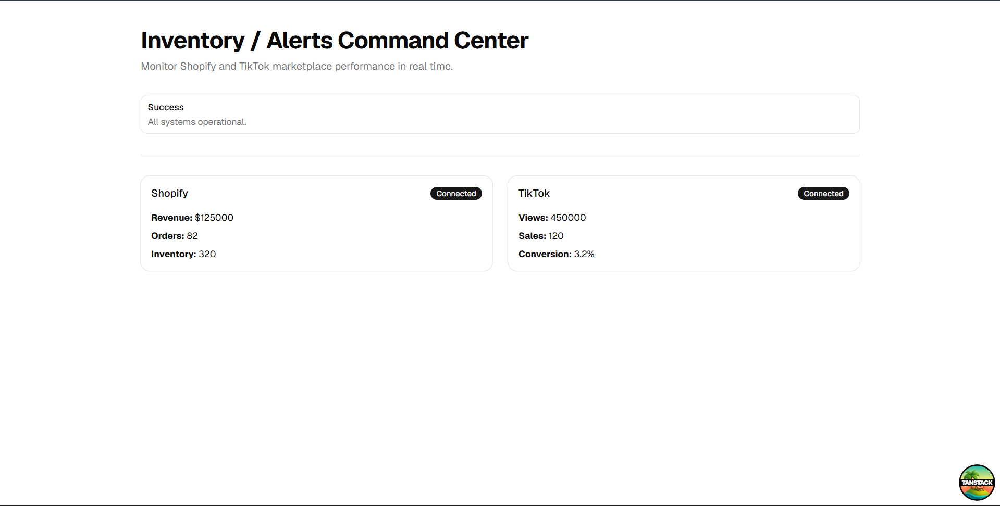
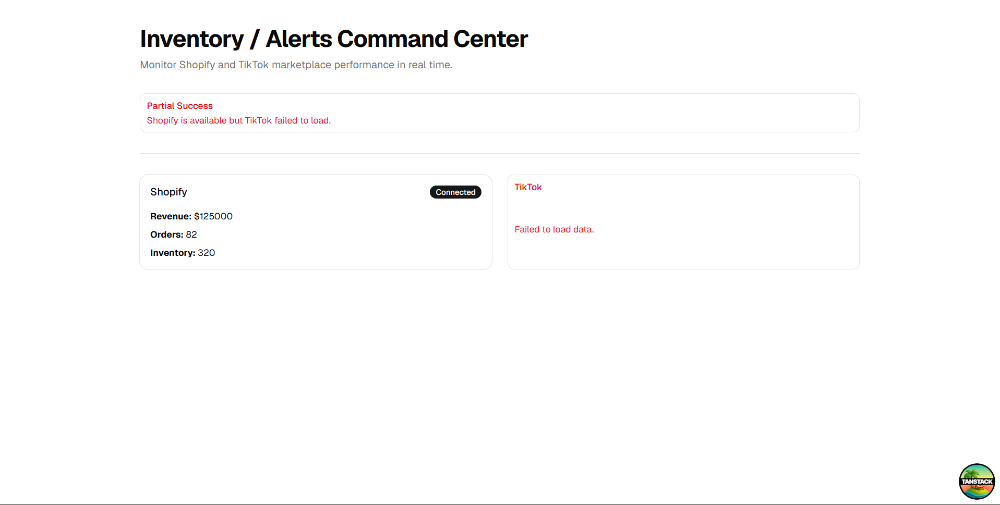
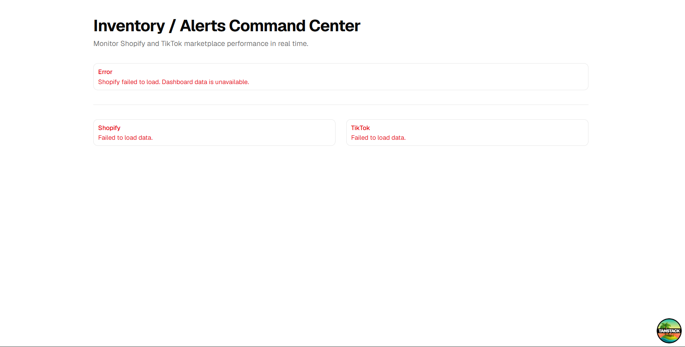

# E-Commerce Analytics Dashboard

Technical Assignment submission for the **Junior Fullstack Engineer** role at **Gyud Technologies**.

## Tech Stack

- TanStack Start
- React 19
- Tailwind CSS
- Shadcn UI
- Node.js
- Express.js

## Project Structure

```
frontend/   # React + TanStack Start
backend/    # Mock REST API
```

## Run Locally

### 1. Start the Backend

```bash
cd backend
npm install
npm start
```

Backend runs at:

```
http://localhost:3001
```

### 2. Start the Frontend

```bash
cd frontend
npm install
npm run dev
```

Frontend runs at:

```
http://localhost:3000
```

## Mock API Endpoints

- `GET /shopify_data`
- `GET /tiktok_data`

## Run with Docker (Optional)

If Docker Desktop is installed:

```bash
docker compose up --build
```

Frontend: http://localhost:3000

Backend: http://localhost:3001

# UI States

### Loading

Displays loading cards while waiting for API responses.



---

### ✅ Shopify Loaded, Waiting for TikTok

Shopify data is loaded successfully while the application continues waiting for the slower TikTok API response.



---

### Success

Both Shopify and TikTok data are loaded successfully.



---

### Partial Success

Shopify loads successfully while TikTok returns an error.



---

### Error

To demonstrate the **Error** state shown below, temporarily change all API endpoints in `backend/server.js` so they return an HTTP `500` response instead of successful data.

```javascript
app.get("/shopify_data", (req, res) => {
  res.status(500).json({
    error: "Shopify unavailable",
  })
})

app.get("/tiktok_data", (req, res) => {
  res.status(500).json({
    error: "TikTok unavailable",
  })
})
```

Restart the backend:

```bash
npm start
```

The frontend will display the Shopify **Error** state.




The dashboard demonstrates the required **Loading**, **Success**, **Partial Success**, and **Error** states using mocked API responses.

**JARELL E. PORTILLAS**  
Bachelor of Science in Information Technology (BSIT) Graduate  
Junior Fullstack Engineer Applicant  

Thank you for reviewing my technical assignment for the Junior Fullstack Engineer role at **Gyud Technologies**.